<picture>
  <source media="(prefers-color-scheme: dark)" srcset="assets/banner-dark.svg">
  <source media="(prefers-color-scheme: light)" srcset="assets/banner-light.svg">
  
</picture>

I build web apps end to end, from the React interface to the database, and add AI where it earns its place. 
<strong>Open to software, full-stack and backend internships.</strong>

## Featured projects

<table>
  <tr>
    <td align="center" width="33%">
      <a href="https://github.com/saumya-st/Karyaa">
        <picture>
          <source media="(prefers-color-scheme: dark)" srcset="assets/card-karyaa-dark.svg">
          <source media="(prefers-color-scheme: light)" srcset="assets/card-karyaa-light.svg">
          
        </picture>
      </a> 
      <a href="https://karya-gilt.vercel.app">Live demo</a> · <a href="https://github.com/saumya-st/Karyaa">Source</a>
    </td>
    <td align="center" width="33%">
      <a href="https://github.com/saumya-st/JANSEWA-PROJECT">
        <picture>
          <source media="(prefers-color-scheme: dark)" srcset="assets/card-jansewa-project-dark.svg">
          <source media="(prefers-color-scheme: light)" srcset="assets/card-jansewa-project-light.svg">
          
        </picture>
      </a> 
      <a href="https://github.com/saumya-st/JANSEWA-PROJECT">Source</a> <!-- TODO: add live demo link once deployed -->
    </td>
    <td align="center" width="33%">
      <a href="https://github.com/saumya-st/STUDY-ASSIS">
        <picture>
          <source media="(prefers-color-scheme: dark)" srcset="assets/card-study-assis-dark.svg">
          <source media="(prefers-color-scheme: light)" srcset="assets/card-study-assis-light.svg">
          
        </picture>
      </a> 
      <a href="https://stae-study.streamlit.app">Live demo</a> · <a href="https://github.com/saumya-st/STUDY-ASSIS">Source</a>
    </td>
  </tr>
</table>

## Tech stack

<picture>
  <source media="(prefers-color-scheme: dark)" srcset="assets/stack-dark.svg">
  <source media="(prefers-color-scheme: light)" srcset="assets/stack-light.svg">
  
</picture>

## Certifications

- **AWS Certified Cloud Practitioner**
- Infosys Springboard: NoSQL Databases, Java Spring Training · Red Hat Academy: Introduction to Linux

## Contact

  <a href="mailto:saumyacodes02@gmail.com">saumyacodes02@gmail.com</a> ·
  <a href="https://www.linkedin.com/in/saumya-tiwari-22909a330">LinkedIn</a> ·
  <a href="https://saumya-tiwari.vercel.app">Portfolio</a>

