<picture>
  <source media="(prefers-color-scheme: dark)" srcset="assets/banner-dark.svg">
  <source media="(prefers-color-scheme: light)" srcset="assets/banner-light.svg">
  
</picture>

Third-year B.Tech Computer Science student at KIET Group of Institutions, Delhi. I build full-stack web apps end to end, from the React interface to the database, and I like adding a small, useful AI feature where it earns its place. **Open to software, full-stack and backend internships.**

## Featured projects

| Project | What it does | Stack | Links |
| :--- | :--- | :--- | :--- |
| **Karya** | Team task management with JWT auth, server-side role checks, kanban boards, invite links and Google Calendar sync. | Next.js 16, TypeScript, Prisma, Neon Postgres, NextAuth | [Live](https://karya-gilt.vercel.app) · [Code](https://github.com/saumya-st/Karyaa) |
| **Jansewa** | Offline-first civic issue reporting. Reports queue in IndexedDB and sync to Firestore when the device is back online. Gemini predicts issue priority. | React, Vite, Firebase, Supabase Storage, Gemini API | [Code](https://github.com/saumya-st/JANSEWA-PROJECT) <!-- TODO: add live demo URL once deployed --> |
| **AI Study Coach** | Generates time-blocked study schedules with Groq, logs focus sessions in SQLite, tracks streaks and exports CSV. | Python, Streamlit, SQLite, Groq API | [Live](https://stae-study.streamlit.app) · [Code](https://github.com/saumya-st/STUDY-ASSIS) |

## Tech stack

| | |
| :--- | :--- |
| **Frontend** | React, Next.js (App Router), TypeScript, Tailwind CSS, Vite, Streamlit |
| **Backend** | Node.js, Next.js Server Actions, NextAuth (JWT), Zod validation, Python, Java |
| **Databases** | PostgreSQL (Neon, Prisma), Firebase Firestore, SQLite, Supabase Storage, IndexedDB |
| **Cloud & AI** | AWS (Certified Cloud Practitioner), Vercel, Streamlit Cloud, GitHub Actions, Docker, Gemini API, Groq API |

## Certifications

- **AWS Certified Cloud Practitioner**
- Infosys Springboard: NoSQL Databases, Java Spring Training · Red Hat Academy: Introduction to Linux

## Contact

[Email](mailto:saumyacodes02@gmail.com) · [LinkedIn](https://www.linkedin.com/in/saumya-tiwari-22909a330) · [Portfolio](https://saumya-tiwari.vercel.app)
