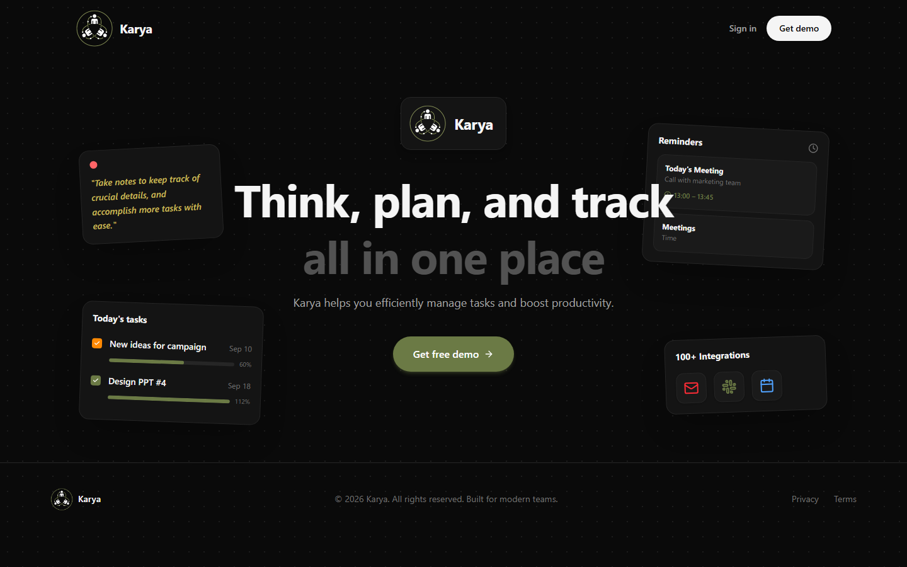
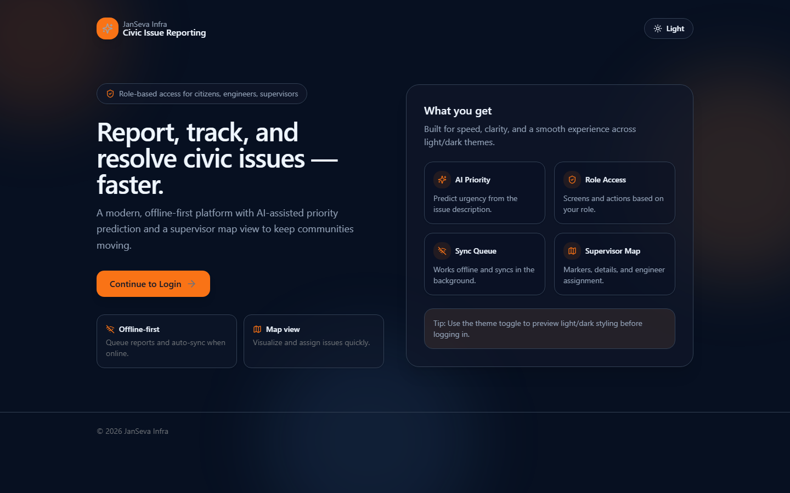
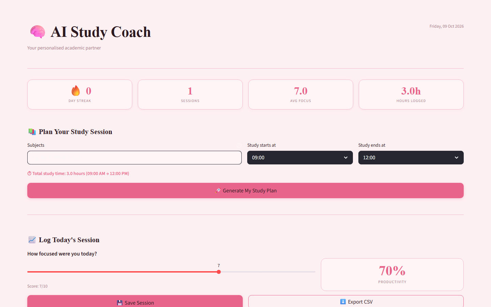

<picture>
  <source media="(prefers-color-scheme: dark)" srcset="assets/banner-dark.svg">
  <source media="(prefers-color-scheme: light)" srcset="assets/banner-light.svg">
  
</picture>

<p align="center">
  
  
  <br>
  
  
  
  
  
  
  
  
  
</p>

## 👋 Hey, I'm Saumya

**From the React button to the Postgres row, I build the whole thing.**

Most apps break in the gaps between frontend, backend and data.
I like owning all three, so there are fewer gaps.
And I add AI only where it earns its place.

## ✨ What you get when I build something

- **Security that isn't an afterthought.** Karya checks roles on the server for every action, not just in the UI.
- **Apps that survive bad Wi-Fi.** Jansewa queues reports offline and syncs them when you're back online.
- **AI with a real job.** Gemini sets the priority of civic issues. Groq builds time-blocked study plans.
- **Shipped, not just coded.** Two of my three projects are live. Click and try them.

## 🚀 Projects

| Project | Why it's cool | Stack | Try it |
| --- | --- | --- | --- |
| **Karya** | Team task manager with kanban boards, invites and Google Calendar sync. Every action is role-checked on the server. | Next.js · Prisma · Postgres · JWT | [Live](https://karya-gilt.vercel.app) · [Source](https://github.com/saumya-st/Karyaa) |
| **Jansewa** | Report civic issues even offline. Reports wait in IndexedDB, sync to Firestore, and Gemini predicts their priority. | React · Firebase · Supabase · Gemini | [Source](https://github.com/saumya-st/JANSEWA-PROJECT) |
| **AI Study Coach** | Groq plans your study time in blocks. Focus sessions are logged in SQLite, with streaks and CSV export. | Python · Streamlit · SQLite · Groq | [Live](https://stae-study.streamlit.app) · [Source](https://github.com/saumya-st/STUDY-ASSIS) |

## 📸 Screenshots / Demo

| Karya | Jansewa | AI Study Coach |
| --- | --- | --- |
|  |  |  |

## 🧰 Tech Stack

| Layer | Tools |
| --- | --- |
| **Frontend** | React, Next.js, TypeScript, Tailwind CSS, Vite, Streamlit |
| **Backend** | Node.js, Server Actions, NextAuth (JWT), Zod, Python, Java |
| **Data** | PostgreSQL, Prisma, Firestore, SQLite, Supabase Storage, IndexedDB |
| **Cloud & AI** | Vercel, Streamlit Cloud, GitHub Actions, Docker, Gemini API, Groq API |

## 🏁 Getting Started

Want to run one of my projects locally? Grab it here.

**You'll need:** Git, plus Node.js 20 or newer for Karya and Jansewa, or Python 3.11 or newer for AI Study Coach.

```bash
# Karya
git clone https://github.com/saumya-st/Karyaa.git
cd Karyaa
```

```bash
# Jansewa
git clone https://github.com/saumya-st/JANSEWA-PROJECT.git
cd JANSEWA-PROJECT
```

```bash
# AI Study Coach
git clone https://github.com/saumya-st/STUDY-ASSIS.git
cd STUDY-ASSIS
```

Then follow the install and run steps in that repo's README.

## 🏅 Certifications

- AWS Certified Cloud Practitioner
- Infosys Springboard: NoSQL Databases, Java Spring Training
- Red Hat Academy: Introduction to Linux

## 🤝 Contributing

Spotted a bug or have an idea? Open an issue on that project's repo.
Pull requests are welcome too. Keep them small and explain the why.

## 📄 License

All three projects are released under the MIT License. See the LICENSE file in each repo.

## 📬 Let's Build Something

If a project helped or inspired you, **drop a ⭐ on it**. It genuinely makes my day.
Hiring for software, full-stack or backend internships? Let's talk.

[saumyacodes02@gmail.com](mailto:saumyacodes02@gmail.com) · [LinkedIn](https://www.linkedin.com/in/saumya-tiwari-22909a330) · [Portfolio](https://saumya-tiwari.vercel.app)
